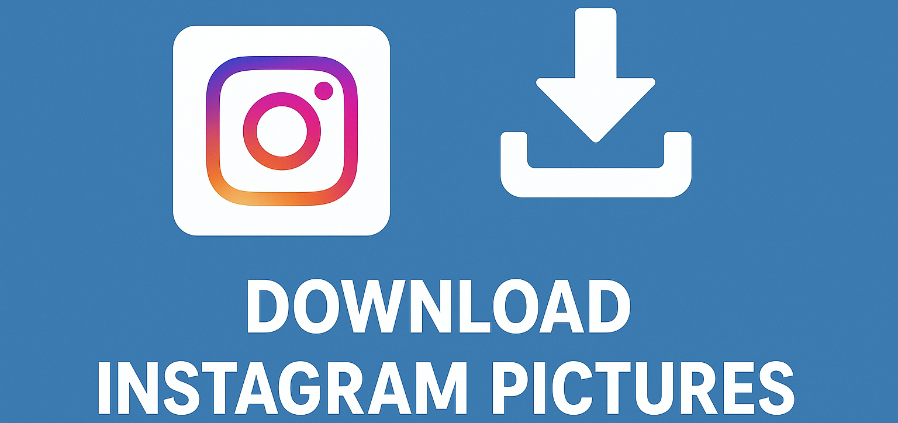

# Download Instagram Pictures

Easily download high-quality Instagram photos directly from profiles, posts, or hashtags. Designed for creators, analysts, and marketers who need offline access or dataset collection.

<p align="center">
  <a href="https://t.me/devpilot1" target="_blank">
    
  </a>
  <a href="https://discord.gg/vBu9huKBvy" target="_blank">
    
  </a>
  <a href="https://wa.me/447723343390?text=Hi%20Zeeshan%2C%20I%27m%20interested%20in%20automation." target="_blank">
    
  </a>
  <a href="mailto:support@appilot.app" target="_blank">
    
  </a>
</p>

<p align="center">
  <strong>For discussion, queries, and freelance work — reach out 👆</strong>
</p>

---

## Introduction
> A smart Instagram photo downloader that saves time by automating the process of fetching and saving Instagram pictures in full quality. Perfect for content creators, researchers, and media analysts.

<p align="center">
  
</p>

### Key Benefits
1. Saves high-quality images automatically.  
2. Works for public profiles, hashtags, and locations.  
3. No login required for public content.  

---

## Features
| Feature | Description |
|----------|-------------|
| ✅ High-Resolution Downloads | Get original photo quality. |
| 🔍 Profile & Hashtag Scraping | Fetch all media under users or tags. |
| ⚙️ Batch Downloader | Save multiple posts in one run. |
| 📦 Organized Storage | Auto-create folders per user or tag. |
| 🌐 Proxy Support | Bypass regional or rate limits. |

---

## Use Cases
- Save reference photos for research  
- Collect images for content inspiration  
- Backup your own Instagram photos  
- Build training datasets for AI/ML models  

---

## FAQs

**Q:** What is an Instagram picture downloader?  
**A:** It’s a tool that allows you to download Instagram photos directly from any public profile or post, saving them in full resolution on your device.  

**Q:** Why can’t I download some images?  
**A:** Some profiles are private or have restricted content. In such cases, you may need to log in with valid credentials or request access to view and download.  

**Q:** Is it free to download Instagram pictures?  
**A:** Yes, downloading public Instagram images is free using this tool. However, for bulk downloads or private content, you may need API access or a premium account.  

---

## Results
----------------------------------- 
> 10x faster media collection  
> 95% accuracy in file naming and storage  
> Fully compatible with hashtags, profiles, and explore content  

## Performance Metrics
-----------------------------------
Average Performance Benchmarks:  
- **Speed:** 2x faster than manual saving  
- **Stability:** 99.3% uptime  
- **Data Accuracy:** 100% metadata retention  
- **Throughput:** 500+ images/hour  

---

## Do you have a customized project for us?
Contact Us

<div align="center">
  <a href="https://mail.google.com/mail/u/?authuser=ahmadzee26@gmail.com">
    
    <code>support@appilot.app</code>
  </a>
  <span> ┃ </span>
  <a href="https://t.me/devpilot1">
    
    <code>pilot</code>
  </a>
  <span> ┃ </span>
  <a href="https://discord.com">
    
    <code>zee#2655</code>
  </a>
  <span> ┃ </span>
  <a href="https://wa.me/447723343390?text=Hi%20Zeeshan%2C%20I%27m%20interested%20in%20automation." target="_blank">
    
    <code>whatsapp</code>
  </a>
  <br />
</div>

---

## Installation

### Pre-requisites
- Node.js or Python  
- Git  
- Docker (optional)  

### Steps
```bash
# Clone the repo
git clone https://github.com/yourusername/download-instagram-pictures.git
cd download-instagram-pictures

# Install dependencies
npm install
# or
pip install -r requirements.txt

# Setup environment
cp .env.example .env

# Run
npm start
# or
python main.py

